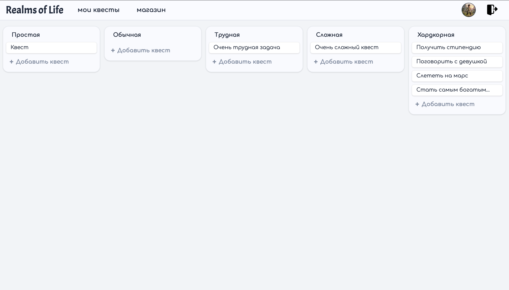
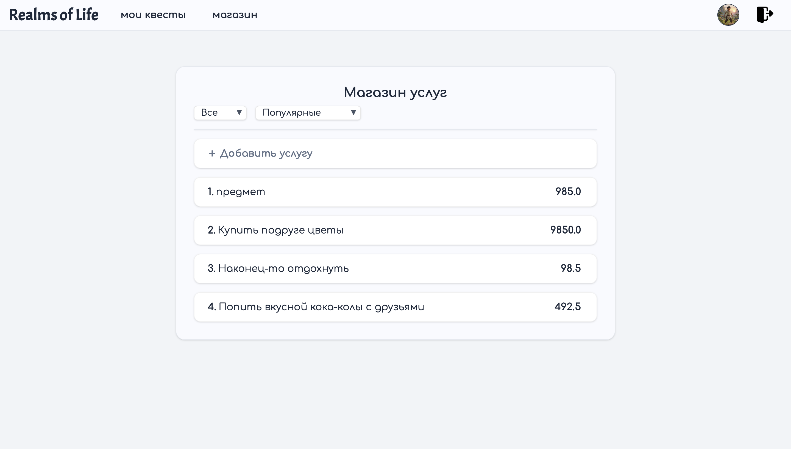
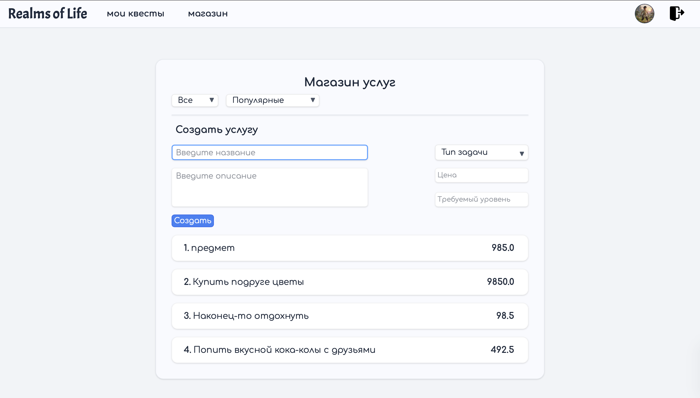
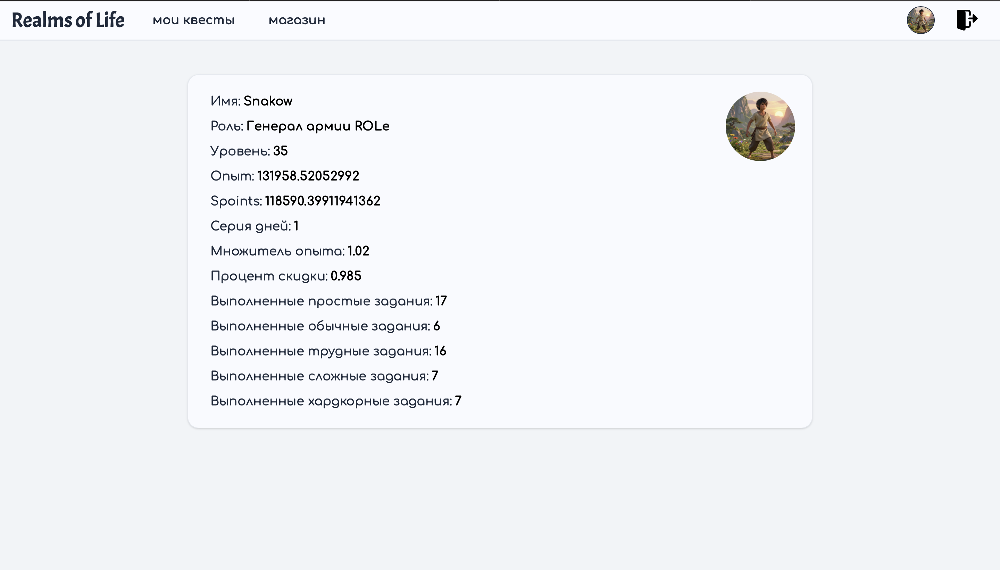

# Realms Of Life(ROLe)
 
  
  
____
#### **🚀Игра, в которой ты можешь стать продуктивней**

> **Языки:** RU

В игре есть все для улучшения твоего **🎮РЕАЛЬНОГО игрового процесса**:
- Canban-доски
- Магазин с кастомными товарами
- Полная статистика всех действий
- Достигаемая персонализация

<br>

#### 📋Canban-доски:

> Удобная визуализация твоих задач, которые ты поставил

##### Есть 5 категорий досок(в дальнейшем будут кастомные):
- **Простые**(срок действия **1 день**) – 20 Spoints, 20 xp + бонусы
- **Обычные**(срок действия **1 день**) – 50 Spoints, 50 xp + бонусы
- **Трудные**(срок действия **неделя**) – 200 Spoints, 200 xp + бонусы
- **Сложные**(срок действия **месяц**) – 500 Spoints, 500 xp + бонусы
- **Хардкорные**(без срока) - 5000 Spoints, 5000 xp + бонусы

##### Бонус за повышения уровня:
- 200 Spoints

##### Бонус за последний выполненный квест:
- **+50%** к Spoints

##### Недельный бонус(все закрытые трудные квесты):
- 150 Spoints
- 2% к множителю Spoints(действует к бонусам за квесты)
- 1.5% к скидке в магазине
- Множители и скидки увеличиваются в **геометрической прогрессии**(если к 200% множителю прибавляются 2%, то это уже не 2, а 4%)

##### Серия дней(days streak)
За выполнение любого квеста за день, серия дней **увеличивается на 1**

##### Наказание за невыполнение квестов
- Сбрасывается серия дней, если не выполнил ни одного квеста
- Сбрасывается недельные множители и скидки, если за 2 недели не выполнил недельный план трудных задач

___

___

#### Магазин кастомных товаров и не очень

Здесь можно купить кастомные товары, которые **ты можешь создать сам**. Пока здесь можно купить только свои, но с обновлениями, здесь можно будет взять и другие предметы.

В магазине используется валюта, называемая **Spoints**

___



___

#### Профиль, самое важное

Spoints, выполненные квесты, уровень, xp, все здесь есть

Кстати, забыл упомянуть о системе ролей, с повышением уровня, есть шанс, что роль повысится, самая наивысшая роль - **легенда ROLe**

___

___

<!-- ### Установка ROLe в Docker-контейнер

> **ROLe** - это не какой либо сайт, который хранит твои данные, это твое **собственное локальное приложение**

#### 1. Устанавливаем Git(если ещё не установили)

#### 2. Клонируем репозиторий

> Для этого подбираем желаемую папку и прописываем:

Заходим в терминал ОС и переходим к выбранной папке и пишем команду:

```terminal
git clone https://github.com/Snakow-creator/ROLe.git .
```

#### 2.1 (по желанию) Меняем конфигурацию .env

Можно здесь поменять адрес коллекции, и JWT-токен, но его можно не менять, если использовать его в локальной сети

#### 3. Устанавливаем Docker

Для Docker-образа, не для Linux, подойдет [Docker-Desktop](https://www.docker.com/products/docker-desktop/)

#### 4. Устанавливаем контейнер

В терминале пишем:

```terminal
docker compose build
```

#### 5. Запускаем контейнер

В терминале пишем

```terminal
docker compose up
```

Все готово к использованию!


<br>

#### Если выхотите упростить способ запуска контейнера

##### Для MacOS(Automator)

> Данный скрипт позволяет одним кликом запускать Docker, запускать контейнеры и **открывать страницу с ROLe**
(почти как полноценное приложение)

1. Создаем новый файл и выбираем **Application**
2. Выбираем в Library **Utilities** и нажимаем справа **Run Shell Script**
3. Выбираем режим `/bin/bash` если он не выбран
4. Копируем код и изменяем нужные значения

```shell
# 1. Запуск Docker Desktop, если не запущен (без показа окна)
open --hide --background -a Docker

# 2. Ждём, пока Docker запустится (проверяем сокет)
until /usr/local/bin/docker info >/dev/null 2>&1; do
    sleep 2
done

# 3. Переход в проект
cd 'папка с ROLe' # изменить

# 4. Запуск контейнеров
/usr/local/bin/docker compose up -d

# 5. Ждём, пока веб-сервер поднимется
until curl -s http://127.0.0.1:5173 >/dev/null; do
    sleep 2
done

# 6. Открытие сайта
open "http://127.0.0.1:5173"

exit 0
``` -->
